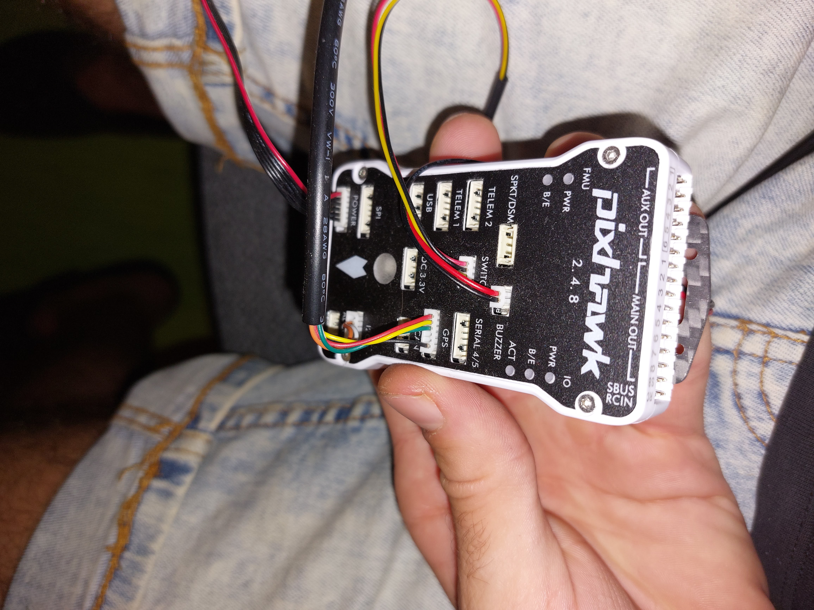
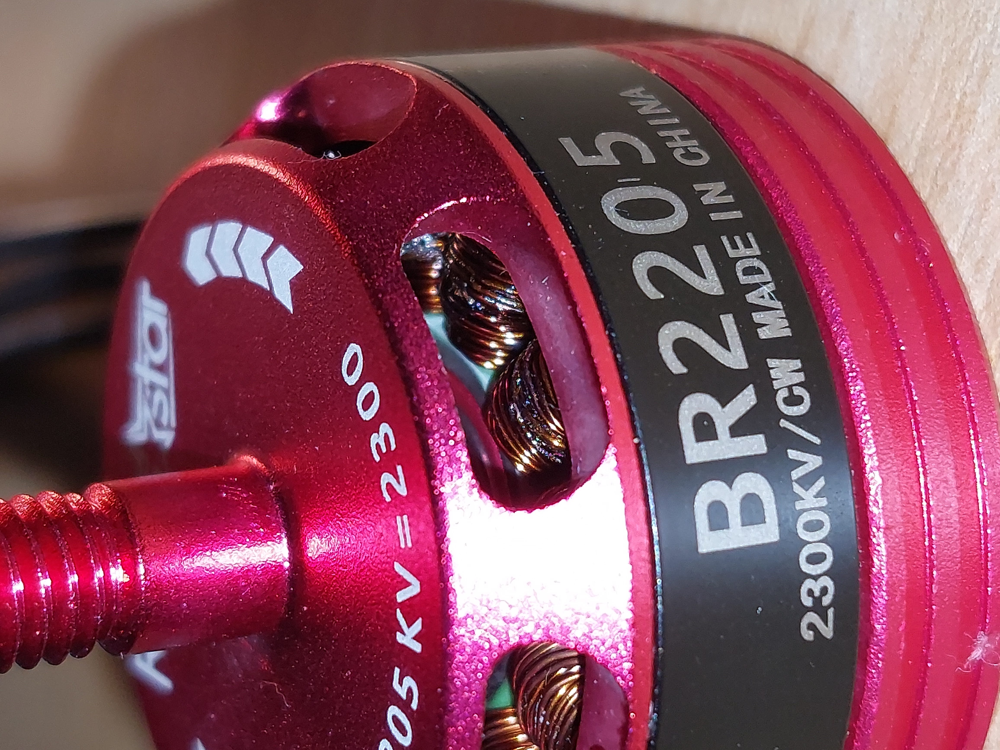
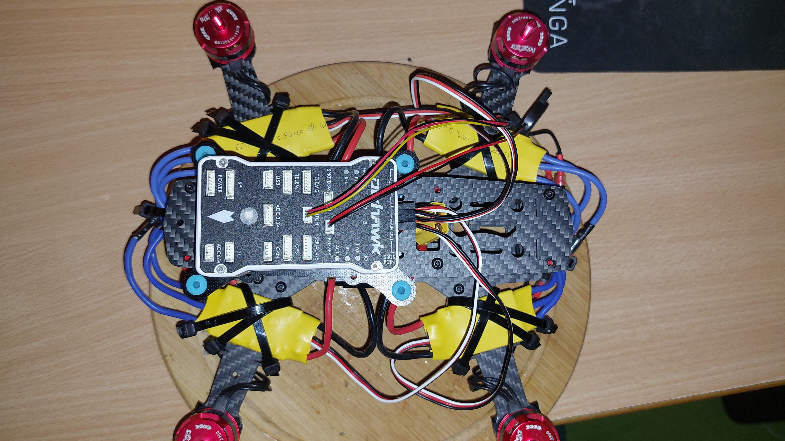

# DIY Drone Project: From Racing Frame to F450 and Back

This repository documents the evolution, build process, and flight testing of my custom-built quadcopter. The project has undergone several iterations, experimenting with different frames and power configurations to find the optimal balance of agility and stability.

### Current Status:
After experimenting with a larger **F450 frame** (plastic/nylon arms), I decided to revert to the **Carbon Fiber Racing Frame**. The high-KV motors and lightweight structure proved to be a much better match for the agility I'm looking for.

A comprehensive technical documentation of a DIY drone build, evolving from a high-speed racing chassis to a utility frame and back, focusing on the integration of ArduPilot on racing-grade hardware.

---

## 📖 Table of Contents
1. [Project Vision](#-project-vision)
2. [Technical Specifications](#-technical-specifications)
3. [Design Evolution & Iterations](#-design-evolution--iterations)
4. [The Troubleshooting Chronicles](#-the-troubleshooting-chronicles)
5. [Software & Parameter Configuration](#-software--parameter-configuration)
6. [Media Gallery](#-media-gallery)
7. [Future Roadmap](#-future-roadmap)

---

## 🎯 Project Vision
The core objective of this project is to bridge the gap between **Racing Hardware** (High-KV motors, 4-in-1 ESCs) and **Professional Flight Controllers** (Pixhawk 2.4.8). This project documents the challenges of signal logic level conversion, frame resonance, and advanced ArduPilot parameter tuning.

---

## 🛠 Technical Specifications

### Core Flight Stack
| Component | Model | Key Specs |
| :--- | :--- | :--- |
| **Flight Controller** | Pixhawk 2.4.8 | 32-bit STM32F427, ArduCopter Firmware |
| **Motors** | Racerstar BR2205 | 2300KV, 3S-4S Support |
| **ESC** | JHEMCU EM40A 4-in-1 | 40A Continuous, BLHeli_S, DShot600 |
| **PDB** | Matek PDB-XT60 | Dual BEC (5V/12V), XT60 Integrated |
| **Receiver** | FlySky FS-iA6 / iA6B | 2.4GHz AFHDS 2A |
| **Frame** | Carbon Fiber Racing | 210mm Wheelbase, 4mm Arms |

### Propulsion System
* **Propellers:** 5045 3-Blade High-Efficiency Props.
* **Battery:** 1550mAh 3S/4S LiPo.
* **Thrust-to-Weight Ratio:** Estimated 4.5:1 on 4S.

---

## 📈 Design Evolution & Iterations

### Iteration 1: The Racing Foundation
Initial assembly on a carbon fiber racing frame. Focus on minimizing weight and centralizing the Pixhawk's mass on a vibration-damped mount.

### Iteration 2: The F450 "Big Frame" Experiment
Attempted to migrate electronics to a plastic/nylon F450 frame.
* **The Failure:** 2300KV motors were inefficient with the larger propellers required for this frame.
* **Result:** Reverted to the original Carbon Fiber chassis for optimal agility and motor matching.

---

## 🔍 The Troubleshooting Chronicles
*A detailed log of hardware and software hurdles encountered during the bench-testing phase.*

### 1. The ESC Signal Voltage Gap (3.3V vs 5V)
* **The Problem:** JHEMCU EM40A ESCs (BLHeli_S) often require a 5V logic signal, whereas Pixhawk 2.4.8 outputs 3.3V signal pulses.
* **Symptom:** Motors beeped but refused to spin even when the safety switch was armed.
* **Diagnosis:** Multimeter testing confirmed a signal pulse of ~1.52V, which was insufficient to "wake up" the modern ESC processors.
* **Solution:** Used a "Bypass Test" by connecting the ESC signal wire directly to the receiver's Channel 3 to confirm hardware functionality.

### 2. Radio Failsafe & Calibration Issues
* **The Problem:** Mission Planner showed a constant "Radio Failsafe" with Throttle stuck at 900-901.
* **Diagnosis:** Incorrect pinout on the FS-iA6 receiver. The signal wire was physically connected to the receiver instead of passing through the Pixhawk RC input during calibration tests.
* **Solution:** Standardized the PPM/i-Bus connection and adjusted `FS_THR_VALUE` below 950 to prevent pre-arm triggers.

### 3. The "Compass 3 Not Found" Bug
* **The Problem:** ArduPilot firmware searching for a non-existent third internal compass.
* **Solution:** Disabled `COMPASS_USE3` in the Full Parameter List to clear the Pre-Arm safety check.

---

## ⚙ Software & Parameter Configuration
Key ArduPilot parameters optimized for this racing build:

| Parameter | Value | Description |
| :--- | :--- | :--- |
| `MOT_PWM_TYPE` | 0 (Normal) | Forced to PWM due to Pixhawk 2.4.8 MAIN port limitations. |
| `BRD_SAFETYENABLE` | 0 | Disabled for bench testing to bypass hardware safety button. |
| `FRAME_CLASS` | 1 | Configured as Quadcopter. |
| `FRAME_TYPE` | 1 | Configured as X-Frame. |
| `MOT_SPIN_ARM` | 0.15 | Increased idle spin to overcome high-KV motor inertia. |

---

## 📸 Media Gallery

### Build Process
| Pixhawk 2.4.8 | Racerstar 2300KV Motor | Internal Wiring |
| :---: | :---: | :---: |
|  |  |  |

### Testing & Results
* **Stability Tests:** Achieving stable hover before moving to manual/acro modes.
* **Log Analysis:** Reviewing flight data to minimize vibrations and improve response time.

---

## ⚙️ Software & Tools
* **Firmware:** ArduCopter / PX4.
* **Diagnostics:** `MultiWiiConf` for real-time sensor visualization and orientation checks.

---

## 🚀 Future Roadmap
- [ ] **Level Shifter Integration:** Install a 3.3V to 5V logic level shifter to ensure reliable ESC communication.
- [ ] **PID Tuning:** Perform AutoTune once stable hover is achieved.
- [ ] **Raspberry Pi Integration:** Utilize the Raspberry Pi 4 as a companion computer for MAVLink-based computer vision.
- [ ] **GPS/Loiter Testing:** Finalize GPS mounting for autonomous flight modes.

---
